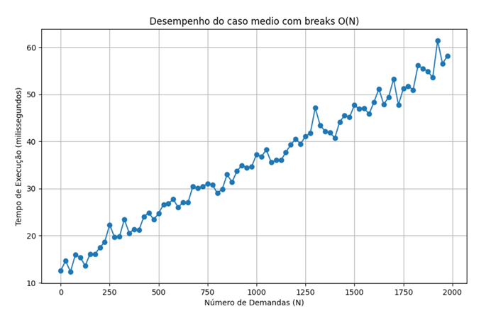
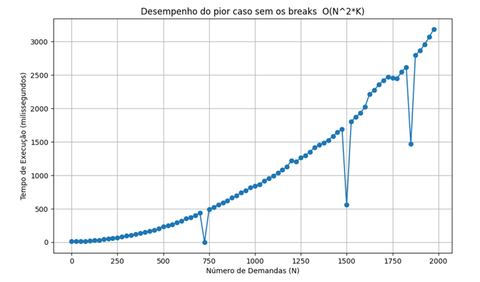

# Simulador-Transporte-CabeAi-Trabalho-Pratico-2
=======

Trabalho Prático II da disciplina de **Estrutura de Dados** (UFMG)

---

## Sobre o Projeto

Este projeto implementa um sistema de **Despacho de Transporte por Aplicativo** baseado em **Simulação de Eventos Discretos (SED)**. 
O objetivo principal é gerenciar uma frota de veículos e passageiros, decidindo dinamicamente quais solicitações de corrida podem ser **compartilhadas** para aumentar a eficiência do sistema e reduzir custos.

O simulador processa um fluxo temporal de demandas, aplica heurísticas de agrupamento baseadas em proximidade espacial e temporal, e executa a viagem virtualmente utilizando um escalonador de eventos.

---

## Algoritmos e Estruturas de Dados

O projeto foi desenvolvido em **C++** (padrão C++11), priorizando a gestão manual de memória e eficiência, sem o uso de contêineres complexos da STL (como `std::vector` ou `std::list` para as estruturas centrais).

### 1. Simulação de Eventos Discretos (SED)
Diferente de simulações contínuas, o sistema "salta" no tempo processando apenas momentos críticos (eventos).
* **Escalonador (Min-Heap):** Implementado manualmente para gerenciar a fila de prioridade de eventos. Garante que o próximo evento a ser processado seja sempre o de menor tempo ($O(\log n)$), mantendo a consistência cronológica (causalidade).

### 2. Heurística de Compartilhamento (Greedy)
Na fase de agrupamento, o algoritmo decide se uma demanda $c_i$ pode ser unida a uma demanda anterior $c_0$ verificando rigidamente:
1.  **Intervalo Temporal ($\delta$):** Se a solicitação ocorreu dentro de uma janela de tempo aceitável.
2.  **Proximidade ($\alpha$ e $\beta$):** Se as origens e destinos estão geometricamente próximos (Distância Euclidiana).
3.  **Eficiência ($\lambda$):** Se o desvio da rota compartilhada não excede um limiar de custo em comparação às rotas individuais.

### Análise de Complexidade

| Componente | Algoritmo / Estrutura | Complexidade de Tempo | Complexidade de Espaço |
| :--- | :--- | :--- | :--- |
| **Agrupamento (Pior Caso)** | Varredura Exaustiva | $O(N^2 \cdot K)$ | $O(N)$ |
| **Agrupamento (Caso Médio)** | Varredura com *Breaks* | $O(N)$ | $O(N)$ |
| **Escalonador (Inserção)** | Min-Heap (`heapify_up`) | $O(\log M)$ | $O(1)$ |
| **Simulação (Execução)** | Processamento de Eventos | $O(M \log M)$ | $O(M)$ |

*Onde $N$ é o número de demandas, $K$ a capacidade do veículo e $M$ o número total de eventos gerados.*

---

## 📂 Estrutura de Diretórios

~~~bash
TP2/
├── src/          # Código fonte (.cpp) - Main, Corrida, Escalonador, etc.
├── include/      # Cabeçalhos (.h) - Definições dos TADs
├── bin/          # Executável final (tp3.out)
├── obj/          # Arquivos objeto de compilação
├── assets/       # Gráficos e relatórios
└── Makefile      # Automação da compilação
~~~

---

## ⚙️ Compilação e Execução

### Pré-requisitos
* Compilador **G++** (suporte a C++11)
* Ambiente Linux

### Como Compilar
Na raiz do projeto, execute:

~~~bash
make all
~~~

### Como Executar
O programa lê os parâmetros e demandas da entrada padrão (**stdin**).

~~~bash
./bin/tp2.out < input.txt
~~~

### Formato de Entrada
A primeira parte do arquivo define os parâmetros de restrição, seguida pela lista de demandas:

~~~plaintext
<capacidade> <velocidade> <delta> <alfa> <beta> <eficiencia> <num_demandas>
<id> <tempo> <origem_x> <origem_y> <destino_x> <destino_y>
...
~~~

---

## 📊 Resultados Experimentais

A análise experimental demonstrou a importância das otimizações de "poda" (breaks) no algoritmo de agrupamento.

* **Cenário Realista:** Com as restrições de tempo e distância ativas, o algoritmo opera de forma praticamente linear $O(N)$, pois descarta rapidamente candidatos inviáveis.
* **Cenário de Estresse:** Ao relaxar totalmente os parâmetros (permitindo qualquer combinação), o algoritmo degrada para $O(N^2)$, comparando todas as demandas entre si.

### Gráfico de Desempenho
#### Cenário implementado com breaks

#### Cenário de Estresse

---

## 📄 Autoria e Licença

Este projeto foi desenvolvido por **Marcos Aurelio Santos** como parte da avaliação da disciplina de Estruturas de Dados da UFMG.

**Autor:** Marcos Aurelio Santos
**Contato:** [LinkedIn](https://www.linkedin.com/in/marcos9247)

© 2025 Marcos Aurelio Santos. Código disponível para fins de estudo.
